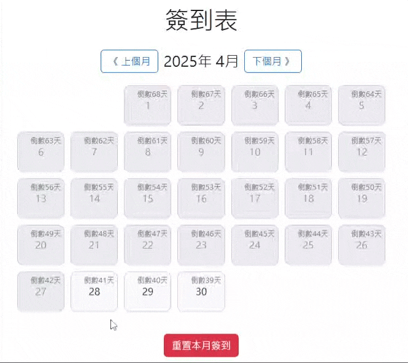

# 📅 簽到行事曆 (HTML + JavaScript + Bootstrap)

這是一個使用原生 HTML、JavaScript 和 Bootstrap 製作的「簽到行事曆」。  
支援：

- 點擊日期簽到/取消
- 動態打章、震動畫面效果
- 簽到紀錄儲存至 LocalStorage
- 顯示倒數考試天數
- 自動生成當月日曆，今天以前的日期無法簽到

---

## 🚀 使用方式

1. 下載或複製專案檔案到本地。
2. 確保有連接網路以載入 Bootstrap CDN（或自行下載 Bootstrap）。
3. 用瀏覽器直接打開 `index.html`。

---

## 🛠 功能介紹

| 功能             | 說明                                                   |
| :--------------- | :----------------------------------------------------- |
| 行事曆顯示       | 根據當前月份自動生成完整月曆                           |
| 簽到打章動畫     | 點擊日期後，會有紅色圈起來＋抖動動畫效果               |
| 取消簽到         | 已簽到的日期再點一次可取消                             |
| 儲存資料         | 使用 LocalStorage 保存簽到紀錄，刷新頁面不會消失       |
| 禁止點擊過去日期 | 今天以前的日期無法再進行簽到或取消                     |
| 倒數考試天數     | 在每個日期格子上方顯示距離考試日（預設 6/7）的天數倒數 |

---

## 📦 技術細節

- HTML5
- JavaScript (原生)
- Bootstrap 5
- LocalStorage 資料保存
- 簡單動畫 (CSS 動畫)

---

## 📋 注意事項

- 預設考試日期是 6/7，可以在 `script.js` 內調整 `examDate` 變數。
- 行事曆只會顯示「當前月份」，每個月打開會自動切換。
- 行事曆最大寬度可在 CSS 自行調整（建議調大以適應桌面螢幕）。

---

## ✨ 額外建議 (可自行擴充)

- 增加「切換月份」功能
- 自訂印章圖片或顏色
- 匯出簽到紀錄（例如存成 CSV 檔）
- 行動裝置最佳化版面

---

# 🖼 預覽

> 
